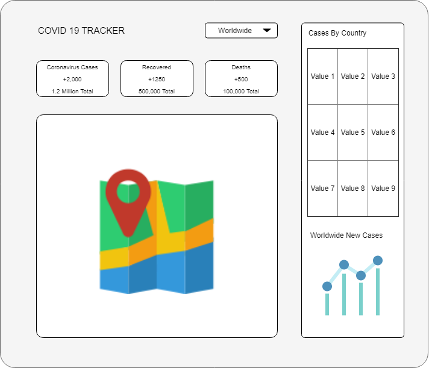

# COVID-19 Tracker
This web app has been developed using React & uses [disease.sh](https://disease.sh/) - Open Disease Data API in backend for getting the COVID-19 data
It is deployed using Firebase Hosting

> Link: https://covid-19-tracker-53aa4.web.app/

<h3 align="center">Wireframe of the web app</h3>
<p align="center"></p>

<h3 align="center">Web App</h3>
<p align="center"></p>
<p align="center"></p>

## Installation
> Note : Follow these steps only if you want to run the web app locally in you machine or make changes to it

1. Clone the repository into a folder
```
$ git clone https://github.com/kishore-s-15/COVID-19-Tracker.git
```

2. Then from the project folder, run `npm start`, which runs the app in the development mode.<br />

   Open [http://localhost:3000](http://localhost:3000) to view it in the browser.
   
3. After making the necessary changes, if you want to deploy the web app run `npm run build`.<br />

   This command builds the app for production, by bundling React in production mode and optimizes the build for the best performance. 
